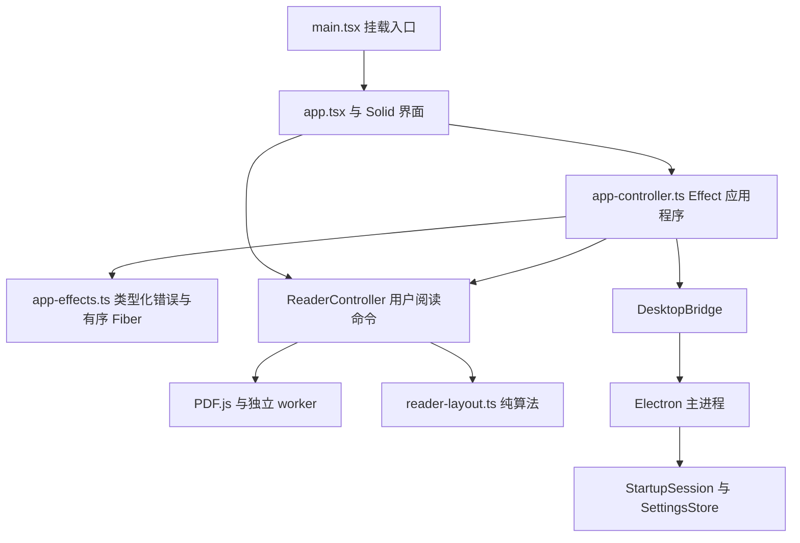

# 架构与生命周期

界面由 Solid 管理，应用控制层使用 Effect 4.0.0 组织异步流程、类型化错误、依赖注入和资源生命周期。PDF.js ReaderController、阅读算法、Electron/preload 安全接口及现有样式保持原职责。

## 状态和资源归属

| 所有者           | 状态与资源                                                                                     |
| ---------------- | ---------------------------------------------------------------------------------------------- |
| 应用控制层       | 文件身份、应用阶段、有序操作/保存 Fiber、会话最近文件、密码 Deferred、桌面订阅 Scope、退出状态 |
| Solid 界面       | 控制层和 reader 的浅层显示快照、侧栏、查询和防抖、输入草稿、菜单、焦点、目录展开               |
| ReaderController | 文档、worker、实际页码/缩放/锚点、搜索高亮、PDF 页面 DOM、滚动与布局观察器                     |
| Electron 主进程  | 文件授权、真实窗口状态、最近文件持久化、原生打开顺序                                           |

文件字节、PDF.js 对象和 DOM 节点保持普通资源引用。界面直接调用 reader 的阅读命令，Solid 响应式 effect 仅处理显示，不将快照回写 reader。

## 应用控制接口

`createAppController()` 是 Solid/Promise 互操作入口：提供 `AppEnvironment` 服务并执行 `makeAppController`。该 Effect 程序通过 `Context.Service` 获取 `DesktopBridge`、reader 工厂、状态通知和少量界面事件。测试可以使用相同入口注入替身，也可以直接提供 Effect 服务；实例回调保留创建时的 Context，因此注入的 Clock、Logger 同样作用于后续任务。当前只有一个应用环境依赖，直接提供服务即可，无需额外 Layer 依赖图。

- `start()` 只执行一次。先将启动操作入队，再安装桌面订阅。preload 的启动确认仍独立于 PDF 打开完成。
- 打开、关闭按队列顺序处理；每次切换先捕获并写入旧文档位置，再关闭 reader、选择新文档恢复位置。
- 保存闭包持有独立文件 ID 和位置副本。写入时直接使用快照；原生 B→A 事件中的旧磁盘位置由当前会话最新位置覆盖。
- 浏览器会话保留原始字节，每次打开复制数据，允许 PDF.js 将输入缓冲区转移给 worker。
- `reader.open()` 可以通过 `onError` / `onState` 报告失败后正常返回。控制层同时检查 `loaded`，再进入可阅读阶段。
- 桌面初始窗口状态响应使用修订号校验，较新的事件优先；释放后的异步响应和已排队事件保持静默。
- 非可取消的文件对话框、启动读取与最近记录读取可以退出等待；保存与 reader 释放仍由应用实例跟踪。

## Effect 程序与函数式约定

- 流程使用 `Effect.gen`、`pipe` 和可组合的 Effect 值；业务错误为 `Data.TaggedEnum` 数据，通过 `catchTag` / `catchTags` 处理。
- `FileAccessError` 标识启动、选择器、最近文件和字节读取；`ReaderError` 标识打开、关闭和销毁；`PositionSaveError` 保留文档 ID；`PlatformError` 标识窗口和外链操作；`InputError` 表示输入校验失败。Promise 拒绝与同步适配器抛错均由 `Effect.tryPromise` 映射，保留原始 cause。用户提示在控制层生成。
- 预期错误有明确恢复策略。缺陷交给 Effect Logger 记录，资源终结器继续执行；中断保持独立语义，正常取消不显示文件损坏提示。保存失败不自动重试，也不阻塞后续独立保存。
- 每个提交的 Fiber 显式等待前一个 Fiber 完成，操作与保存各有一条独立序列。单纯互斥允许新任务在唤醒等待者前插队，因此这里采用前驱依赖保证 FIFO。`whenIdle()` 反复观察队尾，直到已接受任务全部完成。
- 任务先让出一个微任务，完成 Scope 注册后才进入可重入的 reader/桥接回调。同一事件任务中的退出可以冻结尚未开始的打开操作。
- 状态通知、位置和文件身份使用独立快照；会话记录更新替换对象。局部可变引用只用于实例拥有的资源、阶段和队列游标，不使用可变业务类或全局服务单例。
- 密码使用 `Deferred`；位置防抖使用 `Effect.sleep` 和可中断 Fiber，时间来自可注入 Clock。应用控制层已移除手工 Promise 链、`Promise.race`、reader Promise 集合、退订数组和 `setTimeout`。
- PDF.js、preload 和 Solid 的现有 Promise/回调接口保持互操作；reader 内部算法与 Electron 主进程异步实现保持原样。

每个应用实例拥有一个并行终结的根 Scope：

| 资源                          | Scope 与结束行为                                                                |
| ----------------------------- | ------------------------------------------------------------------------------- |
| 外部读取、窗口/外链请求、防抖 | 外部 Scope；退出或释放时中断等待，消费迟到的 Promise 结果                       |
| 桌面订阅                      | 订阅 Scope；`acquireRelease` 保证释放，包括获取过程中发生同步卸载               |
| 打开/关闭 Fiber               | 操作 Scope；已拥有的 reader 工作等待完成，停止后跳过排队的后续操作              |
| 保存 Fiber                    | 保存 Scope；不可中断，按文档快照顺序完成全部已接受写入                          |
| reader                        | 根 Scope 的 `acquireRelease` 终结器；立即开始 `destroy()`，与其他终结器共同等待 |

中断外部等待不会撤销已经发送到主进程的 IPC，也不会关闭原生对话框。迟到结果失去修改当前实例的权限。reader 和保存的完成属于本实例的责任，释放 Promise 持续等待它们；系统强杀仍无法保证最后一次持久化。

采用 Effect 官方 [服务](https://effect.website/docs/v4/requirements-management/services/)、[Scope](https://effect.website/docs/v4/resource-management/scope/) 和 [Fiber](https://effect.website/docs/v4/concurrency/fibers/) 的 v4 API；实际签名同时由安装版本的 TypeScript 类型检查。

## DOM 约定

`ReaderHost` 在空态、打开、阅读、关闭和错误阶段保持同一对 `viewerContainer` / `viewer` 节点。打开和关闭时宿主使用 `visibility: hidden`，保持可测量；仅空态和错误阶段使用 `hidden`。打开时 PDF.js 据此计算初始适应比例与恢复锚点。普通关闭先捕获最终位置、发布关闭阶段，再等待保存并调用 `reader.close()`；等待期间 reader 仍存活，原生 ResizeObserver 和动画帧刷新需要有效的宿主尺寸与页面 offsetParent。工具栏收起可以改变可用尺寸与实时适应比例，保存使用关闭前冻结的位置快照。

Solid 管理外壳和宿主显隐；PDF.js 独占 viewer 后代、宿主滚动、布局 dataset 与布局 CSS 变量。工具栏、菜单和侧栏更新保留现有 PDF 页面节点。文档切换调用 `reader.close()`，实例卸载调用 `reader.destroy()`。

数字输入将实际显示值保存在组件作用域的 memo 中，编辑草稿使用独立 signal。读者状态更新不会覆盖聚焦草稿；输入法组合期间保持焦点，组合结束后显式提交。事件处理器读取已有 memo，避免在响应式所有者之外创建计算。

## 两种结束路径

### 窗口退出

1. `beforeunload` 取消第一次 Electron 关闭。
2. 捕获最终位置，冻结命令，完成密码 Deferred 并关闭外部 Scope。
3. 等待有序保存 Fiber 全部完成；reader 仍可独立等待 outline 等任务。
4. 下一宏任务重新调用窗口关闭，允许第二次关闭。

此时 reader 在最终位置捕获前保持可用。普通组件卸载与窗口退出分别处理。

### 应用实例释放

`mountApplication(host, options)` 返回幂等的异步 `dispose()`，由挂载所有者、入口热替换或窗口卸载调用。组件内部另有幂等的资源释放函数，Solid 清理回调只调用该函数；根节点卸载由挂载所有者执行：

1. 捕获最终位置。
2. 标记失效，完成密码 Deferred，提交最终保存，结束界面事件/观察器。
3. 关闭根 Scope：同一任务内解除订阅、中断外部等待、调用 reader 销毁，立即中止正在打开的 worker/密码任务。
4. 移除 Solid 外壳，等待全部 Scope 终结器以及已拥有的 reader 工作和保存完成。

释放过程在等待打开队列之前启动中止。受控卸载和测试显式等待 Promise；窗口卸载仅触发释放。系统强制结束进程仍可能丢失最后进度。

`app.tsx` 和 `components/reader-host.tsx` 使用 Solid 的文件级热更新跳过标记，将模块替换交给 `main.tsx` 的显式依赖接收回调。入口串行等待旧实例的释放与最终保存，再挂载新实例。Vite 不等待接收回调返回的 Promise，因此替换队列由入口持有；入口自身替换时立即销毁当前 reader，并等待整条队列，已停止的入口跳过后续挂载。应用模块更新会重建界面；桌面端可从最近文件恢复已保存位置。`ReaderHost` 的节点由 reader 持有，其更新沿应用模块传播到入口，完成旧 reader 释放和保存后再替换宿主。其余子组件仍使用 Solid 热替换，标题栏更新保留当前 reader 和阅读位置。

## 工具链与开发编排

- 配置集中在 `vite.config.ts`；原 `vitest.config.ts` 已删除。
- Bun 的 `vite` 依赖和 override 指向 Vite+ core，满足 peer 解析。配置使用 `vite-plus`，测试使用 `vite-plus/test`；`scripts/dev.mjs` 的程序化 Vite API 继续从 `vite` 导入。
- 开发脚本先解析 Electron，再启动本地服务器，将实际端口传给 Electron。退出时在同一信号任务内启动 Electron 和 Vite 的清理，随后等待两者，防止 Vite 的独立 SIGTERM 处理提前退出父进程。
- 检查保留历史排版，针对修改文件运行格式化；全库 lint 和类型检查由 `bun run check` 执行。
- 本地 PDF 资源插件、CSP、ES2022、相对 base 和 electron-builder 分发保持原职责。开发热更新回归分别覆盖标题栏替换后的 reader 稳定性，以及应用模块或阅读宿主替换时的资源释放、阻塞保存和新界面可用性。

## 测试入口

| 文件                            | 验证职责                                                                         |
| ------------------------------- | -------------------------------------------------------------------------------- |
| `tests/app-controller.test.ts`  | 生命周期、保存身份、FIFO 微任务竞争、迟到回调、退出、重复实例、Clock/Logger 注入 |
| `tests/app-effects.test.ts`     | 同步抛错/异步拒绝的类型化映射、保存错误身份与恢复                                |
| `tests/dev.test.ts`             | LF/CRLF 两种源码换行下的开发编排、端口注入、信号竞态与启动失败清理               |
| `tests/e2e/reader.spec.ts`      | 生产阅读、恢复、离线、安全、密码、输入草稿与浏览器字节复用                       |
| `tests/e2e/lifecycle.spec.ts`   | 真实 Solid/PDF.js 四种阶段卸载、重复挂载、阻塞保存期间关闭宿主尺寸和资源释放     |
| `tests/e2e/development.spec.ts` | 开发离线资源和 Solid 标题栏热更新                                                |
| `tests/e2e/app-hmr.spec.ts`     | 应用、阅读宿主与入口热更新、阻塞保存归属、旧实例释放和新 reader 可用性           |
| `scripts/measure-reader.ts`     | 同夹具、同设置的生产打开/搜索/长任务/worker/堆趋势测量                           |

生产代码提供可注入的挂载接口，测试仪器仅位于测试模块。未添加生产全局调试入口或扩大 DesktopBridge 权限。实际结果和限制见 [验证记录](verification.md)。
